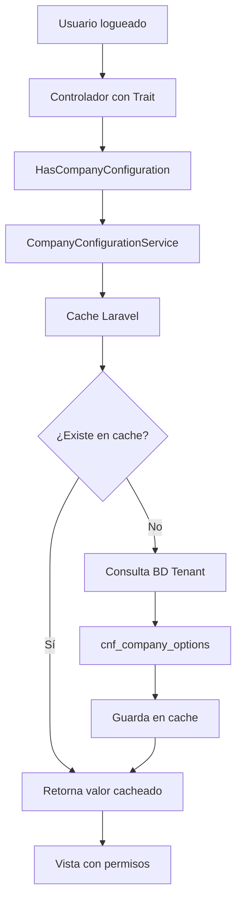

# Sistema de Configuración de Opciones por Empresa

## Índice
1. [Descripción General](#descripción-general)
2. [Estructura de la Base de Datos](#estructura-de-la-base-de-datos)
3. [CompanyConfigurationService](#companyconfigurationservice)
4. [HasCompanyConfiguration Trait](#hascompanyconfiguration-trait)
5. [Ejemplos de Uso](#ejemplos-de-uso)
6. [Mejores Prácticas](#mejores-prácticas)

---

## Descripción General

El sistema de configuración de opciones por empresa permite gestionar dinámicamente las funcionalidades disponibles para cada empresa (tenant) sin necesidad de modificar código. Cada empresa puede tener diferentes niveles de acceso basados en su plan contratado.

### Componentes principales:
- **Base de datos**: `cnf_company_options` (configuración por empresa)
- **Servicio**: `CompanyConfigurationService` (lógica de negocio)
- **Trait**: `HasCompanyConfiguration` (facilitador para controladores)

---

## Estructura de la Base de Datos

### Tabla: `cnf_company_options`

```sql
CREATE TABLE `cnf_company_options` (
  `id` int NOT NULL,
  `company_id` int DEFAULT NULL COMMENT 'ID de empresa (sin FK)',
  `option_id` int DEFAULT NULL COMMENT 'ID de opción (sin FK)',
  `value` int NOT NULL DEFAULT '0' COMMENT '0=deshabilitado, >0=habilitado con valor específico',
  `created_at` datetime NOT NULL,
  `updated_at` datetime DEFAULT NULL,
  `deleted_at` datetime DEFAULT NULL
) ENGINE=InnoDB DEFAULT CHARSET=utf8mb4 COLLATE=utf8mb4_0900_ai_ci;
```

### Lógica de valores:
- `value = 0` → **Deshabilitado**
- `value = 1` → **Habilitado básico**
- `value = 2,3,5,10...` → **Habilitado con límite específico** (ej: número de usuarios, copias para imprimir, etc.)

### Ejemplo de datos:
```sql
INSERT INTO `cnf_company_options` VALUES
(1, 8, 1, 5, '2025-11-12 17:53:20', '2025-11-12 17:53:20', NULL), -- Hasta 5 usuarios
(2, 8, 3, 2, '2025-11-12 17:53:20', '2025-11-12 17:53:20', NULL), -- Hasta 2 copias para imprimir
(3, 8, 16, 1, '2025-11-12 17:53:20', '2025-11-12 17:53:20', NULL); -- Inventario habilitado
```

---

## CompanyConfigurationService

**Ubicación**: `app/Services/Configuration/CompanyConfigurationService.php`

### Descripción
Es el **"motor"** del sistema. Se encarga de:
- Ejecutar consultas a la base de datos
- Manejar el sistema de caché
- Proporcionar la lógica de negocio principal
- Ser el intermediario entre la aplicación y los datos

### Métodos principales:

#### `isOptionEnabled(int $companyId, int $optionId): bool`
Verifica si una opción está habilitada (value != 0).

```php
$service = new CompanyConfigurationService();
$canPrint = $service->isOptionEnabled(8, 3); // true/false
```

#### `getOptionValue(int $companyId, int $optionId): ?int`
Obtiene el valor específico de una opción.

```php
$printLimit = $service->getOptionValue(8, 3); // 2 (número de copias)
```

#### `getEnabledOptions(int $companyId): array`
Obtiene todas las opciones habilitadas para una empresa.

```php
$enabledOptions = $service->getEnabledOptions(8); // [1, 3, 16, 25, ...]
```

#### `setOptionEnabled(int $companyId, int $optionId, bool $enabled): bool`
Habilita o deshabilita una opción.

```php
$service->setOptionEnabled(8, 3, true); // Habilitar impresión
```

### Características importantes:
- ✅ **Caché automático** (60 minutos por defecto)
- ✅ **Conexión tenant** automática
- ✅ **Soft deletes** compatible
- ✅ **Manejo de errores**

---

## HasCompanyConfiguration Trait

**Ubicación**: `app/Traits/HasCompanyConfiguration.php`

### Descripción
Es el **"facilitador"** del sistema. Se encarga de:
- Simplificar el uso en controladores Livewire
- Obtener automáticamente el `company_id` del usuario logueado
- Proporcionar métodos de acceso directo
- Manejar la inicialización automática

### Métodos principales:

#### `isOptionEnabled(int $optionId): bool`
Versión simplificada sin necesidad de especificar company_id.

```php
// En tu controlador
$canPrint = $this->isOptionEnabled(3);
```

#### `getOptionValue(int $optionId): ?int`
Obtiene el valor específico sin especificar company_id.

```php
// En tu controlador
$printLimit = $this->getOptionValue(3);
```

#### `getEnabledOptions(): array`
Obtiene todas las opciones habilitadas.

```php
// En tu controlador
$allOptions = $this->getEnabledOptions();
```

#### `areOptionsEnabled(array $optionIds): array`
Verifica múltiples opciones de una vez.

```php
// En tu controlador
$permissions = $this->areOptionsEnabled([1, 3, 16]); // [1 => true, 3 => false, 16 => true]
```

### Inicialización automática:
```php
public function mount()
{
    $this->initializeCompanyConfiguration(); // Configura automáticamente
}
```

---

## Ejemplos de Uso

### 1. Controlador básico con trait

```php
<?php

namespace App\Livewire\Tenant\Products;

use Livewire\Component;
use App\Traits\HasCompanyConfiguration;

class ProductsController extends Component
{
    use HasCompanyConfiguration;

    public function mount()
    {
        // Inicializar configuración automáticamente
        $this->initializeCompanyConfiguration();
    }

    /**
     * Verifica si puede gestionar inventario
     */
    public function canManageInventory(): bool
    {
        return $this->isOptionEnabled(16); // option_id 16 = inventario
    }

    /**
     * Obtiene el límite de productos que puede crear
     */
    public function getProductLimit(): int
    {
        return $this->getOptionValue(16) ?? 0; // Si value=5, puede crear 5 productos
    }

    /**
     * Verifica si puede exportar datos
     */
    public function canExport(): bool
    {
        return $this->isOptionEnabled(54); // option_id 54 = exportación
    }

    public function createProduct()
    {
        if (!$this->canManageInventory()) {
            session()->flash('error', 'No tienes permisos para gestionar productos.');
            return;
        }

        $currentProducts = Product::count();
        $limit = $this->getProductLimit();

        if ($currentProducts >= $limit) {
            session()->flash('error', "Has alcanzado el límite de {$limit} productos.");
            return;
        }

        // Crear producto...
    }
}
```

### 2. Vista con permisos condicionales

```blade
{{-- resources/views/livewire/products/index.blade.php --}}

<div>
    <h1>Gestión de Productos</h1>

    {{-- Botón crear solo si tiene permisos --}}
    @if($this->canManageInventory())
        <button wire:click="createProduct" class="btn btn-primary">
            Crear Producto ({{ $this->getProductLimit() - $currentProducts }} restantes)
        </button>
    @else
        <div class="alert alert-warning">
            No tienes permisos para gestionar productos. Contacta al administrador.
        </div>
    @endif

    {{-- Botón exportar solo si tiene permisos --}}
    @if($this->canExport())
        <button wire:click="exportProducts" class="btn btn-success">
            Exportar Productos
        </button>
    @endif

    {{-- Lista de productos --}}
    <div class="products-grid">
        @foreach($products as $product)
            <div class="product-card">
                <h3>{{ $product->name }}</h3>

                {{-- Botón editar solo si tiene permisos --}}
                @if($this->canManageInventory())
                    <button wire:click="editProduct({{ $product->id }})">Editar</button>
                @endif
            </div>
        @endforeach
    </div>
</div>
```

### 3. Verificación de múltiples permisos

```php
<?php

namespace App\Livewire\Tenant\Dashboard;

use Livewire\Component;
use App\Traits\HasCompanyConfiguration;

class DashboardController extends Component
{
    use HasCompanyConfiguration;

    public function mount()
    {
        $this->initializeCompanyConfiguration();
    }

    /**
     * Obtiene las funcionalidades disponibles para mostrar en el dashboard
     */
    public function getAvailableFeatures(): array
    {
        // Verificar múltiples opciones de una vez
        $permissions = $this->areOptionsEnabled([
            1,  // múltiples usuarios
            3,  // impresión
            16, // inventario
            25, // punto de venta
            45, // reportes
            54, // exportación
        ]);

        $features = [];

        if ($permissions[1]) {
            $userLimit = $this->getOptionValue(1);
            $features[] = [
                'name' => 'Gestión de Usuarios',
                'description' => "Hasta {$userLimit} usuarios",
                'route' => 'users.index'
            ];
        }

        if ($permissions[3]) {
            $features[] = [
                'name' => 'Impresión de Documentos',
                'description' => 'Imprimir facturas y reportes',
                'route' => 'documents.print'
            ];
        }

        if ($permissions[16]) {
            $features[] = [
                'name' => 'Gestión de Inventario',
                'description' => 'Control de productos y stock',
                'route' => 'inventory.index'
            ];
        }

        if ($permissions[54]) {
            $features[] = [
                'name' => 'Exportación de Datos',
                'description' => 'Exportar a Excel, PDF, CSV',
                'route' => 'exports.index'
            ];
        }

        return $features;
    }
}
```

### 4. Uso sin trait (directo con servicio)

```php
<?php

namespace App\Http\Controllers;

use App\Services\Configuration\CompanyConfigurationService;
use Illuminate\Http\Request;

class ReportsController extends Controller
{
    private CompanyConfigurationService $configService;

    public function __construct(CompanyConfigurationService $configService)
    {
        $this->configService = $configService;
    }

    public function generateReport(Request $request)
    {
        $user = auth()->user();
        $companyId = $user->company_id; // Obtener de donde corresponda

        // Verificar permisos directamente
        if (!$this->configService->isOptionEnabled($companyId, 45)) {
            abort(403, 'No tienes permisos para generar reportes.');
        }

        // Verificar tipo de reporte según valor
        $reportLevel = $this->configService->getOptionValue($companyId, 45);

        if ($reportLevel === 1) {
            // Reportes básicos
            return $this->generateBasicReport();
        } elseif ($reportLevel >= 2) {
            // Reportes avanzados
            return $this->generateAdvancedReport();
        }
    }
}
```

---

## Mejores Prácticas

### ✅ **DO - Hacer**

1. **Usar el trait en Livewire Components**:
   ```php
   use HasCompanyConfiguration;
   ```

2. **Inicializar en mount()**:
   ```php
   public function mount() {
       $this->initializeCompanyConfiguration();
   }
   ```

3. **Crear métodos descriptivos**:
   ```php
   public function canPrintInvoices(): bool {
       return $this->isOptionEnabled(3);
   }
   ```

4. **Verificar permisos antes de acciones críticas**:
   ```php
   if (!$this->canDeleteRecords()) {
       session()->flash('error', 'Sin permisos.');
       return;
   }
   ```

5. **Usar valores para límites**:
   ```php
   $userLimit = $this->getOptionValue(1) ?? 0;
   ```

### ❌ **DON'T - No hacer**

1. **No hardcodear option_ids sin contexto**:
   ```php
   // ❌ Malo
   return $this->isOptionEnabled(3);

   // ✅ Bueno
   const OPTION_PRINT = 3;
   return $this->isOptionEnabled(self::OPTION_PRINT);
   ```

2. **No hacer múltiples consultas innecesarias**:
   ```php
   // ❌ Malo
   $perm1 = $this->isOptionEnabled(1);
   $perm2 = $this->isOptionEnabled(2);
   $perm3 = $this->isOptionEnabled(3);

   // ✅ Bueno
   $perms = $this->areOptionsEnabled([1, 2, 3]);
   ```

3. **No ignorar el caché en producción**:
   ```php
   // ❌ Solo para debugging
   $this->clearConfigurationCache();
   ```

4. **No usar el servicio directamente si tienes el trait**:
   ```php
   // ❌ Innecesario
   $service = app(CompanyConfigurationService::class);
   $service->isOptionEnabled($companyId, 3);

   // ✅ Más simple
   $this->isOptionEnabled(3);
   ```

---

## Flujo de Datos



---

## Soporte y Mantenimiento

- **Logs**: Los métodos incluyen logging automático para debugging
- **Cache**: TTL configurable (60 minutos por defecto)
- **Errores**: Manejo graceful de fallos de BD
- **Performance**: Consultas optimizadas con índices

### Limpiar caché manualmente:
```php
// Limpiar caché específico de una empresa
$this->clearConfigurationCache();

// O desde el servicio
$configService->clearCache($companyId);
```

---

**Documento generado**: 2025-11-18
**Versión**: 1.0
**Autor**: Sistema de configuración multitenant